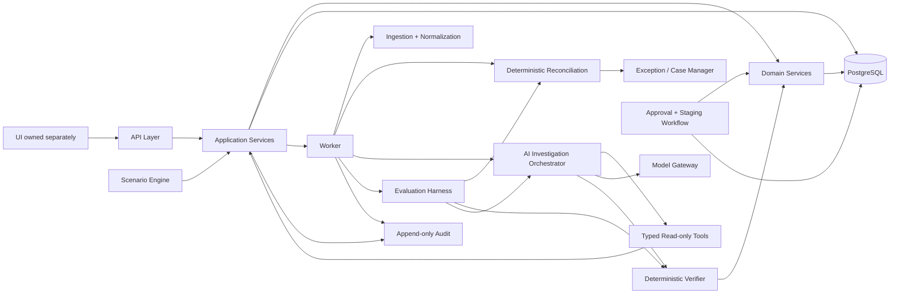

# Architecture — SettlementOps

## 1. Architecture decision

Use a **modular monolith with a separate worker process and PostgreSQL** for the MVP.

This is deliberate. The domain is bounded, the evaluation needs reproducibility, and workflow state should remain transactionally consistent. A modular monolith lets the repository demonstrate separation without manufacturing network boundaries, duplicated contracts, or distributed failure modes.

The architecture is designed so the same domain/application services are reused by:

- interactive scenario instantiation;
- batch data ingestion;
- reconciliation;
- agent investigation;
- evaluation runners;
- approval and staging;
- audit and analytics.

## 2. High-level system



## 3. Layer responsibilities

### API layer
HTTP transport, authentication context, input validation, DTO mapping, idempotency handling and request correlation. No complex business rules.

### Application layer
Coordinates use cases and transaction boundaries: import, reconcile, investigate, approve, reject, request evidence, escalate, instantiate scenario, retrieve case and audit data.

### Domain layer
Owns money representation, lifecycle invariants, reconciliation formulas, cause policy, disposition validation, state-transition rules, and verifier checks. Domain logic must be deterministic and testable without a model provider.

### Persistence layer
Repository interfaces and PostgreSQL adapters. Queries return typed data. Persistence code does not decide business outcomes.

### Worker
Executes long-running or retryable jobs. Shares application/domain modules with the API. It must not reimplement the same business rules.

### Agent layer
Owns investigation state, model invocation, prompt versioning, tool-selection policy, structured output parsing, loop control and trace capture. It cannot access repositories directly.

### Tool layer
Exposes only typed, allowlisted, request-scoped evidence queries. Tools call application/domain services rather than raw database logic.

### Verification layer
Independently recomputes authoritative facts and required checks. It may override the model proposal.

### Workflow layer
Owns case state transitions, approvals, staging, outcome recording and idempotent state mutation.

### Audit/observability layer
Append-only audit events plus structured operational telemetry.

### Evaluation layer
Runs synthetic generation, baseline evaluation, treatment evaluation, leakage audit, challenge sets and statistical analysis without exposing hidden truth to the systems under test.

## 4. Trust boundaries

```text
Untrusted uploaded/synthetic text
          |
          v
Input validation / normalization
          |
          v
Domain services / persistent state
          |
          +----> typed read-only tools ----> AI agent
          |                                  |
          |                                  v
          |                           model proposal
          |                                  |
          +-----------------------------> verifier
                                             |
                                             v
                                      effective disposition
                                             |
                                             v
                                        human approval
                                             |
                                             v
                                        staging record
```

## 5. AI isolation rule

The agent must never depend on direct repository access. All evidence comes through tool/application boundaries. This ensures authorization, tenant scope, logging and data shaping happen before information reaches the model.

## 6. Database as source of persisted workflow state

PostgreSQL stores all state whose correctness must survive process restart:

- financial records;
- normalized records;
- reconciliation cases;
- evidence references;
- investigations;
- tool traces;
- proposals;
- verifier results;
- approvals;
- staging actions;
- outcomes;
- audit events.

In-memory state may be used for transient execution but may not be the only copy of important financial workflow state.

## 7. Worker strategy

Use a durable job abstraction with explicit job state and idempotency. Jobs include reconciliation runs, investigations and evaluation runs. A job retry must not create duplicate state transitions.

## 8. Scenario-engine parity

Interactive scenarios use the same domain/application pipeline as batch evaluation. There is one source of truth for scenario semantics; only the scenario input size and trigger path differ.

## 9. Model gateway

The agent depends on a provider-neutral model interface. Model/provider selection belongs to configuration and evaluation, not the domain layer.

## 10. Why not microservices

A service split would add:

- network failure modes;
- distributed tracing overhead;
- duplicated DTOs/contracts;
- deployment coordination;
- cross-service transaction complexity.

The MVP's modularity is achieved at the code/module boundary instead. Service extraction remains a future option only if a real scaling boundary emerges.

## 11. Architecture review questions

A reviewer should be able to answer from the code:

- Where is financial truth defined?
- Where is model output validated?
- Who can change a case state?
- Where is tenant scope enforced?
- Where is idempotency enforced?
- Where is audit written?
- How does an AI tool access data?
- How is model failure contained?
- How does a scenario use the same pipeline as evaluation?
- What prevents the agent from moving money?

If those questions cannot be answered by following code paths, the architecture is not ready.

## 12. Detailed module map

### `api`
Owns HTTP routes, authentication integration, request parsing, DTO validation, error translation and request correlation.

### `application`
Owns transaction-level use cases and orchestration. It should depend on interfaces rather than concrete infrastructure where possible.

### `domain`
Owns pure business rules. This is the most important dependency boundary in the repository.

### `persistence`
Owns PostgreSQL repositories, migrations and transaction helpers. It never decides whether a financial result is “good”.

### `agent`
Owns model execution, investigation state, structured output parsing, loop control and policy-aware orchestration.

### `tools`
Owns typed evidence tools. Each tool should correspond to one business-readable query or deterministic calculation capability.

### `verification`
Owns independent deterministic validation of model proposals.

### `workflow`
Owns case state transitions, approvals and staging.

### `audit`
Owns immutable event writing and retrieval.

### `evaluation`
Owns synthetic data generation, hidden truth, benchmark execution and statistical reporting.

### `scenario`
Owns controlled interactive scenario definitions and instantiation, but calls shared application services.

## 13. Dependency rules

Allowed direction:

```text
API -----------> Application -----------> Domain
Worker --------> Application -----------> Domain
Agent ---------> Tool Ports -----------> Application/Domain interfaces
Persistence ---> Domain interfaces
Scenario ------> Application
Evaluation ----> Domain + Application interfaces
```

Forbidden direction:

```text
Domain -> API framework
Domain -> LLM SDK
Domain -> PostgreSQL driver
Agent -> PostgreSQL repository implementation
UI -> database
Evaluation -> production hidden-truth endpoint
```

## 14. Interface contracts

Where a dependency crosses module boundaries, prefer a small interface:

- `CaseRepository`
- `SettlementRepository`
- `EvidenceReader`
- `AgentToolRegistry`
- `ModelGateway`
- `Clock`
- `IdGenerator`
- `TransactionRunner`
- `AuditWriter`

The purpose is testability and replacement, not abstraction for its own sake.

## 15. Request-scoped security context

Every application use case that operates on merchant-owned data receives an authorization context containing at minimum:

- authenticated subject;
- merchant/tenant scope;
- role/permissions;
- request ID;
- correlation ID.

Repositories must not infer authorization from user-supplied record IDs.

## 16. Financial calculation architecture

All calculation services return structured breakdowns rather than strings.

Example:

```json
{
  "gross_minor": 1000000,
  "fee_minor": 25000,
  "tax_minor": 4500,
  "refund_minor": 0,
  "adjustment_minor": 0,
  "expected_net_minor": 970500,
  "currency": "INR"
}
```

The verifier consumes structured values and recalculates them independently.

## 17. Agent execution architecture

The agent orchestrator must treat an investigation as a durable job, not as an HTTP request that remains open until the model finishes.

The worker loads the case snapshot, executes model/tool interactions, writes progress and final proposal, then invokes deterministic verification.

## 18. Evidence architecture

Evidence is modeled separately from claims. A claim refers to evidence IDs; evidence refers to actual source records and the tool call that fetched them.

This allows an auditor to answer:

- what was observed?
- when was it observed?
- through which tool?
- under which tenant scope?
- which claim used it?

## 19. Verifier architecture

The verifier must not consume the model's asserted check results as authoritative inputs. It queries authoritative source data and computes the check itself.

The verifier returns:

```text
check_name
status: PASS | FAIL | NOT_RUN
expected_value
observed_value
source_ids
rule_version
reason
```

A `NOT_RUN` mandatory check is not treated as `PASS`.

## 20. Workflow transaction architecture

For state-changing commands:

```text
load current case
 -> verify authorization
 -> verify case version
 -> validate transition
 -> apply domain transition
 -> persist state
 -> append audit event
 -> commit
```

No outside network call occurs inside the critical state transaction unless unavoidable and explicitly documented.

## 21. Persistence strategy

Use normalized write models for authoritative state. Use query/read models when operational UI queries would otherwise require expensive joins.

Read models can be rebuilt from canonical records and must never contain unique financial truth that cannot be reconstructed.

## 22. Background job architecture

Workers should claim jobs atomically, heartbeat long-running work where needed, and mark terminal job outcomes. Retries are policy-driven.

## 23. Graceful degradation

If the model provider is unavailable:

- no source records are lost;
- the case remains durable;
- the investigation is marked failed/retryable;
- safe non-resolve behavior remains available.

If evidence tools are unavailable:

- tool failure is explicit;
- no fabricated evidence is generated;
- the case remains in a safe investigatory state or escalates.

## 24. Architecture quality gate

A reviewer must be able to trace one case from API entry to database write without crossing arbitrary layers or discovering business logic hidden in controllers. If a rule is difficult to locate, the module boundary is probably wrong.

---

# Part II — Readiness Resolutions (v2.0.0, locked 2026-08-31)

Decisions D1–D7 from `IMPLEMENTATION_READINESS.md`. Change records: `CHANGE_CONTROL.md` CC-001…CC-007.

## 25. Locked technology stack (D1)

TypeScript (strict) · Node.js 24 LTS · pnpm workspaces · Fastify · PostgreSQL · Drizzle · Zod · Vitest · OpenAPI · Pino · OpenTelemetry-compatible instrumentation · Docker/Compose.

One consistent stack across the monorepo. Framework choices live at the edges only: **Fastify appears only in `apps/api`; Drizzle only in `packages/persistence`; the model SDK only behind `ModelGateway` in `packages/agent`.** None of the three may appear in `packages/domain`, which has zero runtime dependencies (enforced by `scripts/check-dependencies.ts`, not by review).

Full layout and command surface: `REPOSITORY_STRUCTURE.md` v2.0.0.

## 26. Monorepo and the UI boundary (D2)

`apps/api`, `apps/worker`, `apps/web` + eleven packages. **`apps/web` is user-owned and read-only to the coding agent.**

The boundary is machine-enforced: CI fails if any backend package imports from `apps/web`, if `apps/web` appears in a backend manifest, or if the implementation pipeline touches a file under it. Dependency direction is one-way — the web app consumes the published OpenAPI contract; no backend package may depend on it.

## 27. Authentication boundary (D3)

A swappable `AuthenticationAdapter` resolves a credential into a server-constructed `RequestContext { userId, tenantId, roles, requestId, correlationId }`. The MVP ships a **demo adapter** (seeded identities, non-production only, fails startup in production); a real IdP later implements the same interface with **no change below the boundary**.

Tenant scope is always resolved server-side from stored membership. A tenant ID supplied by a client — or by the model — is data, never authorization. `ARCHITECTURE.md` §15's request-scoped security context is realised as `RequestContext`, and repositories require a `MerchantScope` derived from it as a non-optional, type-level parameter.

Details: `AUTHORIZATION_MODEL.md` v2.0.0.

## 28. Terminal verifier gate (D6)

Amends §19. The verifier is a **terminal, single-pass gate**.

```text
agent investigates (evidence tools) → submits final proposal
        → ONE verifier pass → effective disposition → human
```

Locked properties:

1. The verifier runs **exactly once** per proposal.
2. Its output is **never** returned to the model — not in a prompt, not in a tool result, not in agent context.
3. A verifier failure routes to `ESCALATED`; it does **not** re-enter `INVESTIGATING`.
4. Re-investigation requires a **human** action, and the new run does not receive the prior verifier result.
5. No tool adjudicates a proposal. `validate_candidate_resolution` is **removed** (`TOOLS.md` v2.0.0).

Rationale: a verifier the model can query becomes a feedback oracle. That would compromise safety (proposals fitted to the checker rather than to evidence) and invalidate the primary evaluation metric (measuring checker-satisfaction rather than reasoning). Tools may **compute**; tools may not **adjudicate**.

## 29. Data boundary — hidden truth (D5)

Two databases, two credentials, no path between them.

```text
settlementops_app                    settlementops_eval
├── financial records                ├── hidden ground truth
├── cases, evidence, outcomes        ├── injected defect specification
├── proposals, verifications         ├── generator seeds/parameters
├── approvals, staging, audit        └── scoring oracle
│
└── loaded by apps/api + apps/worker      loaded ONLY by the
    and therefore by agent tools          evaluation harness
```

The application runtime **never loads the evaluation credential**. Hidden truth is not merely unread by the application — it is **unreachable**, because the application's connection has no grant to that database. This is materially stronger than a code-level promise not to read it.

Also locked:

- `Outcome.actual_cause` is renamed **`human_assigned_cause`** and may be written only by a human decision (`DATA_MODEL.md`). The evaluation harness may never write it.
- The scoring oracle joins visible results to hidden truth **inside the evaluation boundary only**, and emits aggregate metrics — never per-case labels back into the application database.

## 30. Amended architecture review questions

Add to §11:

- Which credential can reach hidden truth, and can the application process load it? *(Answer must be: only the evaluation harness; no.)*
- Where does the verifier result flow, and can it reach the model? *(Answer must be: to the database and the human API; no.)*
- How is tenant scope derived, and can a client or the model influence it? *(Answer must be: from stored membership via `RequestContext`; no.)*
- What prevents a backend package from importing `apps/web`? *(Answer must be: a CI gate, not a convention.)*

## 31. Frozen constants

Every numeric assumption — tolerances, timing windows, fee/tax rates, budgets, dataset sizes, evaluation thresholds — is enumerated in `EXPERIMENT_CONSTANTS.md`, currently `PROPOSED`. `INVARIANT`-class values become versioned constants in `packages/domain`; `EXPERIMENT`-class values go in the dataset manifest. **No dataset may be generated before that file is approved.**
